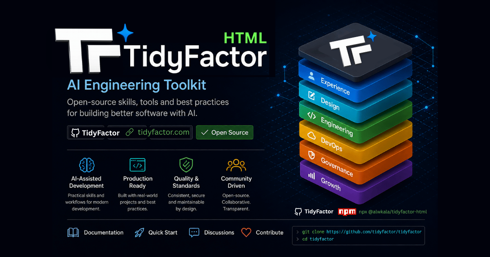

<div align="center">

# 🌐 TidyFactor HTML `v1.2.0`
### 100% Static Platform Starter, Web Components & Contextual Decision Engine

**The official static web engineering track within the TidyFactor Architecture Ecosystem.**

[](https://www.npmjs.com/package/@tidyfactor/html)
[](LICENSE)
[](README.ar.md)
[](#-three-lifecycle-modes)

[🚀 Quick Start](#-quick-start) • [⚡ 9 Commands](#-command-set) • [🏛️ Ecosystem](#%EF%B8%8F-tidyfactor-ecosystem-architecture) • [📖 بالعربية](README.ar.md)

<br/><br/>

<p align="center">
  
</p>

</div>

---

Part of the TidyFactor ecosystem. Sibling tracks (`tidyfactor-php`,
`tidyfactor-vanilla-js`, `tidyfactor-micro-js`, `tidyfactor-track-*`) live
as separate skills so each can carry a full, framework-appropriate
command set instead of one skill trying to cover every stack at once.

## Three lifecycle modes
- **Init** — scaffold a brand-new static project.
- **Convert** — bring an existing site, SPA, or other stack onto this
  track.
- **Improve** — audit and upgrade a project already on this track.

## Command set
`init` · `assets` · `compo` · `store` · `pages` · `modules` · `i18n` ·
`seo` · `deploy` — see `SKILL.md` for the full sequencing and each
command's reference file under `references/commands/`.

## Developer
Built and maintained by **alwkala** — github.com/alwkala

## License
Licensed under the Apache License 2.0.


---

## 🚀 Installation & Quick Start

Choose your preferred installation method:

### Option A: Via TidyFactor CLI (Recommended)
Install directly using the official ecosystem package runner into your active workspace:
```bash
npx @tidyfactor/cli add html
```
*Or if you have the CLI installed globally (`npm i -g @tidyfactor/cli`):*
```bash
tidyfactor add html
```

### Option B: Via Open Agent Skills Ecosystem (skills.sh / Vercel Labs)
Install using the universal multi-agent standard across all supported IDEs (Cursor, Antigravity, Claude Code, Windsurf, Trae, Codex):
```bash
npx skills add tidyfactor/html
```

### Option C: Standalone Zero-Dependency Runner (NPM Direct)
Run the dedicated skill installer directly with automatic cache invalidation:
```bash
npx @tidyfactor/html@latest
```

---

## 🏛️ TidyFactor Ecosystem Architecture

**TidyFactor** is a modular web architecture and AI coding agent skill ecosystem built on clear separation of concerns across the product lifecycle:

```
TidyFactor Organization (github.com/TidyFactor)
│
├── Design Skills
│   ├── Cinematic    → Experience / "Wow"     (Apple × Cartier Scroll-Driven Landing Pages)
│   ├── Design       → Prototype / "Build"    (Code-Native UI Design Engine & Figma Alternative)
│   └── Styler       → Production / "Ship"    (Framework Styler & RTL Polish Engine)
│
├── Development Skills
│   ├── HTML         → Content & Static       (Semantic SEO & Static Platform Starter)
│   ├── HTMX         → Hypermedia             (Server-Driven Micro-Interactions)
│   ├── JS           → Vanilla SPA            (Framework-Free Reactive ES Modules)
│   ├── PHP          → Server-Rendered        (Modern PHP 8.x Component UI & Architecture)
│   └── Next         → Multi-Tenant SaaS      (Next.js 16, React 19, Supabase RLS & Dev-Perf)
│
└── Growth Skills
    └── Marketing    → Growth / Revenue       (Direct Response, Pillar SEO & Content Lifecycles)
```

### 💎 Frontend Triad

```
                TidyFactor
                    │
          ┌─────────┼─────────┐
          │         │         │
      Cinematic   Design    Styler
          │         │         │
      Experience Prototype Production
          │         │         │
       "Wow"      "Build"   "Ship"
```

### 📦 Community Package & Skill Parity

| Track | Category | GitHub Repository | Agent Skill | NPM Package |
| :--- | :--- | :--- | :--- | :--- |
| **Cinematic** | Design | [`TidyFactor/Cinematic`](https://github.com/TidyFactor/Cinematic) | `tidyfactor-cinematic` | [`@tidyfactor/cinematic`](https://www.npmjs.com/package/@tidyfactor/cinematic) |
| **Design** | Design | [`TidyFactor/Design`](https://github.com/TidyFactor/Design) | `tidyfactor-design` | [`@tidyfactor/design`](https://www.npmjs.com/package/@tidyfactor/design) |
| **Styler** | Design | [`TidyFactor/Styler`](https://github.com/TidyFactor/Styler) | `tidyfactor-styler` | [`@tidyfactor/styler`](https://www.npmjs.com/package/@tidyfactor/styler) |
| **Next** | Development | [`TidyFactor/Next`](https://github.com/TidyFactor/Next) | `tidyfactor-next` | [`@tidyfactor/next`](https://www.npmjs.com/package/@tidyfactor/next) |
| **HTML** | Development | [`TidyFactor/HTML`](https://github.com/TidyFactor/HTML) | `tidyfactor-html` | [`@tidyfactor/html`](https://www.npmjs.com/package/@tidyfactor/html) |
| **HTMX** | Development | [`TidyFactor/HTMX`](https://github.com/TidyFactor/HTMX) | `tidyfactor-htmx` | [`@tidyfactor/htmx`](https://www.npmjs.com/package/@tidyfactor/htmx) |
| **JS** | Development | [`TidyFactor/JS`](https://github.com/TidyFactor/JS) | `tidyfactor-js` | [`@tidyfactor/js`](https://www.npmjs.com/package/@tidyfactor/js) |
| **PHP** | Development | [`TidyFactor/PHP`](https://github.com/TidyFactor/PHP) | `tidyfactor-php` | [`@tidyfactor/php`](https://www.npmjs.com/package/@tidyfactor/php) |
| **Marketing** | Growth | [`TidyFactor/Marketing`](https://github.com/TidyFactor/Marketing) | `tidyfactor-marketing` | [`@tidyfactor/marketing`](https://www.npmjs.com/package/@tidyfactor/marketing) |

---

## 👨‍💻 Organization & Support

- 🌐 **Official Website:** [https://tidyfactor.com/](https://tidyfactor.com/)
- 📚 **Official Documentation:** [https://tidyfactor.com/documentation](https://tidyfactor.com/documentation)
- 🤝 **Official Partner Website:** [Alwkala Digital Agency](https://alwkala.com/)
- 🐙 **GitHub Organization:** [github.com/TidyFactor](https://github.com/TidyFactor)
- 📧 **Business Inquiries:** [hello@tidyfactor.com](mailto:hello@tidyfactor.com)
- 📱 **WhatsApp:** [+20 101 665 6899](https://wa.me/201016656899)
- 📞 **Phone:** +20 101 665 6899
- 📍 **Location:** Cairo, Egypt

---

## 📜 License

Licensed under the **Apache License 2.0**. Copyright (c) 2026 [TidyFactor](https://tidyfactor.com) & [Alwkala](https://alwkala.com).
